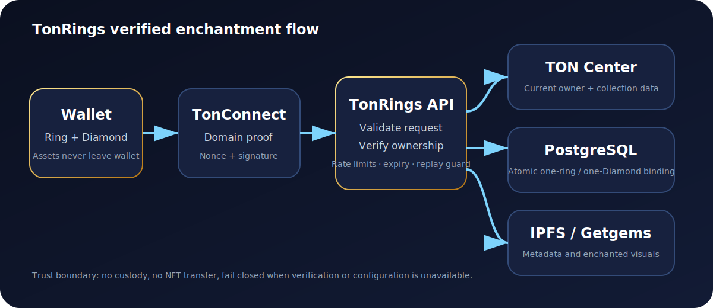

<div align="center">
  

# TonRings

**Non-custodial, ownership-gated TON Diamond enchantments for collectible championship rings.**

[](https://github.com/SoldABox/TonRings/actions/workflows/ci.yml)


</div>

## What TonRings does

TonRings lets a verified wallet bind one eligible **TON Diamond NFT** to one **TonRings NFT** as an application-level enchantment. Neither NFT is transferred, wrapped, burned, or modified by the service.

The backend verifies:

1. A server-issued TonConnect nonce is valid and unused.
2. The TonConnect proof matches the configured domain.
3. `walletStateInit` derives the claimed wallet address.
4. The wallet public key resolves from the address-bound contract.
5. The wallet currently owns both NFTs.
6. Each NFT belongs to the configured collection.
7. The ring and Diamond are not already actively bound.
8. The final binding is committed atomically in PostgreSQL.

> TonRings is an independent project. It is not affiliated with FIFA, TON Foundation, TON Diamonds, Getgems, or any football organization unless a written partnership is announced.

## Architecture



```text
Wallet → TonConnect proof → authenticated session
                               ↓
Ring + Diamond → TON ownership checks → atomic PostgreSQL binding
                                           ↓
                                metadata / enchanted visuals
```

## Implementation status

| Area | Status |
|---|---|
| Strict TypeScript domain core | Implemented |
| TON NFT ownership provider | Implemented |
| On-chain wallet public-key resolver | Implemented |
| TonConnect proof verification | Implemented |
| One-time nonce consumption | Implemented |
| Opaque bearer sessions | Implemented |
| Wallet verification endpoint | Implemented |
| Enchantment binding endpoint | Implemented |
| Atomic ring/Diamond exclusivity | Implemented |
| Revocation and lookup endpoints | Implemented |
| PostgreSQL migrations | Implemented |
| NFT collection generator | Implemented |
| Pinata/IPFS uploader | Implemented |
| Health and readiness probes | Implemented |
| GitHub Actions verification | Configured; latest run must be green |
| Production web interface | Separate frontend still required |

## Repository map

```text
src/
  auth/             TonConnect proof verification
  config/           Environment validation
  enchantment/      Binding rules and domain service
  persistence/      PostgreSQL implementation
  ton/              TON Center adapters
  server.ts         Fastify HTTP application
migrations/         Ordered PostgreSQL migrations
scripts/            Migration, generation, upload and launch validation
tests/              Domain, proof and TON Center tests
docs/               Architecture, API, deployment and launch guides
generated/          Generated assets and metadata; not committed
```

## Quick start

Requirements:

- Node.js 22+
- PostgreSQL
- TON Center API key
- Pinata JWT for upload automation

```bash
cp .env.example .env
npm install
npm run db:migrate
npm run check
npm run dev
```

Check the service:

```bash
curl http://localhost:3000/health
curl http://localhost:3000/ready
```

## Environment variables

| Variable | Purpose |
|---|---|
| `APP_ORIGIN` | Exact allowed frontend origin |
| `TON_PROOF_DOMAIN` | Exact hostname expected in TonConnect proof |
| `TONCENTER_BASE_URL` | TON Center API v3 base; v2 getter calls use the same origin |
| `TONCENTER_API_KEY` | TON Center credential |
| `TON_DIAMONDS_COLLECTION` | Authoritatively verified Diamond collection address |
| `RING_COLLECTION_ADDRESS` | Deployed TonRings collection address |
| `DATABASE_URL` | PostgreSQL connection string |
| `SESSION_SECRET` | Reserved random application secret, minimum 32 characters |
| `PINATA_JWT` | Pinata upload credential |
| `IPFS_GATEWAY` | Public IPFS gateway |
| `COLLECTION_SIZE` | Number of generated ring NFTs |

Never commit `.env`, wallet seeds, private keys, database credentials, or API tokens.

## Commands

| Command | Function |
|---|---|
| `npm run dev` | Run the API with live reload |
| `npm run start` | Start compiled production server |
| `npm run lint` | Run type-aware ESLint |
| `npm run build` | Compile strict TypeScript |
| `npm test` | Run tests with coverage |
| `npm run check` | Lint, build and test |
| `npm run db:migrate` | Apply ordered database migrations |
| `npm run generate` | Generate deterministic collection files |
| `npm run validate:launch` | Validate environment and generated output |
| `npm run upload:ipfs` | Upload generated files to Pinata |
| `npm run prepare:launch` | Generate and validate collection files |
| `npm run preflight` | Full code and launch validation |
| `npm run verify:server` | Verify the local health endpoint |

## API overview

| Method | Endpoint | Purpose |
|---|---|---|
| `GET` | `/health` | Process health |
| `GET` | `/ready` | Configuration and database readiness |
| `POST` | `/api/auth/nonce` | Issue a five-minute TonConnect nonce |
| `POST` | `/api/auth/verify` | Verify wallet proof and issue a session |
| `POST` | `/api/enchantments/bind` | Bind a verified ring and Diamond |
| `GET` | `/api/enchantments/ring/:address` | Find active binding by ring |
| `GET` | `/api/enchantments/diamond/:address` | Find active binding by Diamond |
| `POST` | `/api/enchantments/revoke` | Revoke a binding owned by the session wallet |

See [API reference](docs/API.md).

## Security model

- No custody and no NFT transfer.
- Exact TonConnect domain validation.
- Address-bound `walletStateInit` validation.
- Public keys resolved from wallet contracts, not trusted from client input.
- Short-lived proofs and single-use nonces.
- Opaque session tokens stored only as SHA-256 hashes.
- Normalized TON address comparison.
- Current NFT ownership and collection checks.
- PostgreSQL uniqueness and transaction locks.
- Request body limits, route-level rate limits and restricted CORS.
- Generic production errors without internal stack traces.
- `/ready` fails closed for missing launch configuration or database failure.

Security reports should follow [SECURITY.md](SECURITY.md).

## Deployment

Fastest supported production layout:

1. Managed PostgreSQL.
2. Managed Node/Docker service.
3. Pinata/IPFS for immutable assets.
4. Separate HTTPS frontend with TonConnect UI.

```bash
npm install --no-audit --no-fund
npm run db:migrate
npm run build
npm start
```

Require `/ready` to return HTTP 200 before announcing availability.

See [deployment guide](docs/DEPLOYMENT.md) and [launch checklist](docs/LAUNCH_CHECKLIST.md).

## Documentation

- [Architecture](docs/ARCHITECTURE.md)
- [API reference](docs/API.md)
- [Deployment guide](docs/DEPLOYMENT.md)
- [Launch checklist](docs/LAUNCH_CHECKLIST.md)
- [Security policy](SECURITY.md)

## Licensing

- Source code: MIT License
- Artwork, collection identity and brand assets: all rights reserved unless explicitly stated otherwise
- Third-party NFT names and marks remain property of their respective owners
